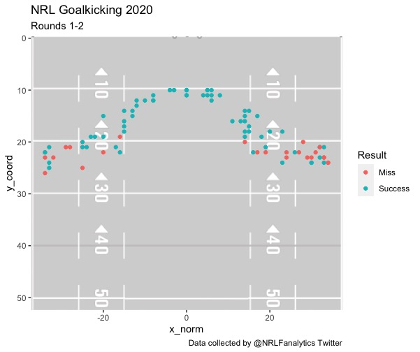

# nrl-goalkicking-model
NRL Goal Kicking Model

We use a logistic regression to fit a model that predicts the success rate of a goal attempt.

## Getting Started

The code to load data, build model, run predictions and create ratings is found in the subdirectory /src.

The data to train the model is found in the subdirectory /data. The data was manually collected by NRL Fanalytics and encompasses Rounds 1 & 2 of the 2020 season.


## Prerequisites

To run the code you will need to install the following packages on your local machine by running the code below.

```
install.packages(tidyverse)
install.packages(ggplot2)
install.packages(png)
```
## Example Output


## Authors

* **Kenji Ball** - [Twitter](https://twitter.com/home), [Medium](https://medium.com/@kenji.ball)

## Acknowledgments

* **NRL Fanalytics** - Thanks for the mammoth effort of manually recording the data used for the model!
* **Mitch Pearson** - Thanks for inspiration, hearing out my ideas and correcting my grammar!
* **The team at Measurem** - Watch this space!

